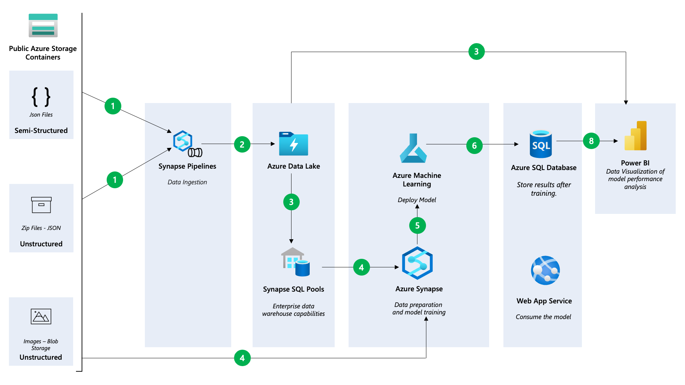

# Create a Data Solution on Azure Synapse Analytics with Snapshot Serengeti - Part 2 (Analytics)

This is the second blog in  in a four-part series on building an end-to-end data analytics and machine learning solution on Azure Synapse Analytics. Check out the first blog at https://aka.ms/synapseserengeti if you haven't before proceeding. 

From the first blog we covered how to create the synapse workspace and use the notebooks to load data into Azure Data Lake Gen2 & the SQL Data Warehouse. In this blog we will explore the integration to Power BI and the Azure Machine Learning service.

To begin, let's connect the SQL data warehouse to Power BI and create a few reports!

To connect to Azure Synapse Analytics using Power BI Desktop, first open the application and click on the "Get Data" button. Then, select "More" to see a wider range of data source options. In the search bar, type in "Synapse" to filter the options and select "Azure Synapse Analytics (SQL)" from the list.

Next you will be prompted to enter your server name. Type in the name of your server and then click on the "Direct Query" option. 

Note that Direct Query is a connection mode that allows you to query data directly from the data source in real-time, without the need to import it into Power BI. On the other hand the Import mode,  data is first loaded into Power BI's internal data model before it can be queried and visualized. Learn more [here](https://learn.microsoft.com/power-bi/connect-data/desktop-directquery-about?WT.mc_id=data-93739-davidabu).

Click Ok and the open Power Query Editor to see the data.

Click on the Annotations table, next on the dropdown next to Category Id uncheck 0 and 1. This is to remove the empty and human categories from the dataset.

Repeat this for the categories table, the click Close and Apply to navigate to the Power BI homepage. 

## Modeling data in Power BI

Our objective is to link the different tables within the model view to create a model link similar to the one below.

To model the data, follow these steps:
1.	Click Categories [id] and drag to connect to annotations[category_id]
2.	Click Categories [name] and drag to connect to train[category_name] and Val[category_name]
3.	Click images[id] and drag to connect to annotations[image_id] and in properties, make the cross filer direction to be BOTH

    

4.	Click images[id] and drag to connect to train[image_id] and Val[image_id]

Now we have completed the modelling of this data and we want to start analyzing the data. Click the top left report view icon to go back to the blank white canvas.

Note: As of March 2023, the Power BI interface as changed, and you might notice during the exercise. Kindly update your Power BI desktop.

## DAX MEASURES
We will create a simple report and we will use some [DAX measures](https://learn.microsoft.com/power-bi/transform-model/desktop-quickstart-learn-dax-basics?WT.mc_id=data-93739-davidabu) to count the rows in the annotation, images, train and Val tables.
To achieve this we'll leverage the [New Quick Measures AI](https://learn.microsoft.com/power-bi/transform-model/quick-measure-suggestions?WT.mc_id=data-93739-davidabu) functionality within Power BI 

1.	Click on Quick Measure at the top.
2.	Click on Suggestions
3.	Type “count how many rows in the images table” and click Generate.

    

4. Click Add
5.At the top bar, you can change the function name “measure” to “Number of images”.
6.	Create the DAX measurement for other tables using the quick measure AI tool.
    - Annotation
    - Train
    - Val
7.	Changed 6A,6B,6C measures to appropriate names accordingly.

## Creating Charts

